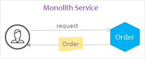

[Home](../../../../../) \| [Back](../../../../#api-gateway)
# Replace-by functionality Of API Gateway

Hi ,  
Today I came across an interesting feature of API-GATEWAY. The feature is known as Replace-by functionality.  
But in order to understand that , we need to go through some other basics.  

We will Start with an example of ORDER service and continue on that.  

Note : All the examples are for explanatory purpose   

So lets START…… :  

### Monolith Service ###  
  

Lets consider an ORDER service which client consumes to get the order details for a given Order ID.  
The response from the ORDER service comprises the below details :  
* Customer details  
* Product details  
* Price for each product  
* Promotions applied on each product  
* Deliver details  

Here the ORDER service performs all the required task and returns the data.  
As we can see that , ORDER service performs many task , we can say that our ORDER service is a MONOLITH(a large single block) service.

**Disadvantages of Monolith Service:**  
* Not so easy to maintain  
* Requires more development effort and delays delivery due to dependency on different modules  
* Complexity increases as time passes by  
* Bug fix takes time , as developer has to look into bigger code size.  
* Unit testing takes time due bigger code size.  
* (There are more… but as of now lets go ahead with these )  

*So What is solution for these disadvantages…?*

Solution :  
If we will break our Monolith service to smaller one then  
* It will be easier to maintain  
* Different team will work on different smaller service  
* Unit testing will be done on smaller set of code  
* Faster delivery  
* Faster bug fix  

Now a days these smaller services are known as Microservices

I will discuss on Microservice in another article , but as of now lets go with simpler definition.

### Microservice: ###  
  

Microservice definition :  
A Microservice is a service , which performs its job related to its DOMAIN only and it behaves as a single unit.
For example :  
* A Customer service will deal with only Customer data – only CUSTOMER DOMAIN  
* The Customer service will have its own Cache,DB etc… So that it can run independently  

So for our ORDER example , we have refactored the existing ORDER service to different smaller/Micro service.
The new Microservices are :  
* Customer – Provides Customer related information  
* Product – Provides Product related information  
* Price – Provides price of a product   
* Promotion – Provides promotion related to product  
* Delivery – Provides delivery details for the Order  
* Cart – Provides shopping cart details related to Order  

OK.. Now you saw that we have refactored the ORDER monolith service to fine grained Microservices.

But wait... As we have many Microservices ,  
Then whether the Client going to do the below tasks :  
* Call all the services   
* Collect all the responses from all the services called  
* Create a single response out of all he responses got  
* Use the response.  

??????  

The answer is NO.  
We need a middle man who will do these for us.  

Here comes API-GATEWAY to rescue us.  

**So What is API-GATEWAY?**  
API Gateway is a software component which does the following jobs  
* Authentication  
* Aggregation  
* Circuit Breaker  
* Throttling  
* Replace-by functionality  
* Load balancing  
* Service discovery  
* Message conversion between different protocol  

**How Client will get response?**  
Client will consume a virtual API URL , which is supported by Api-Gateway.  
When client hits this virtual url , Api-Gateway converts this single request to multiple requests based on parameters provided in URL and sends to Microservices.  
Finally it collects all the responses and creates the single response out of it and return to client.  

So collecting all the responses and creating a single response out of it is known as Aggregation.  

Api-Gateway will not do automatically these for us , we have to configure it as per our requirement.  

As we can see Api-Gatway has many features , today I will talk a little bit about the Replace-by functionality.  

**Replace-by functionality**  
Lets say Client requested for OREDR to Api-Gateway.  
Api-Gateway contacted to all Microservices to get the response.  
But due to some network issue , call to Delivery service failed.  

**So what should we do now?**  
Are we going to return an ERROR to client , even if we have around 80% data available with us.  

No.... We can configure the Api-Gateway in such a way that :  
* If the call to Delivery service Fails , it will go to a Cache and get the last default delivery details  
* If reading from Cache fails , then it will take a hardcoded response  

In this way , Api-Gateway will create a default response if a Microservice call fails  
Now it will create the final response with default values for Delivery and return the response to client.  

So , providing the default values for any failed service call is known as Replace-by functionality.  

Happy Learning… :)

[Home](https://debbiswal.github.io/Tech-BITE) \| [Back](https://debbiswal.github.io/Tech-BITE/#api-gateway)
