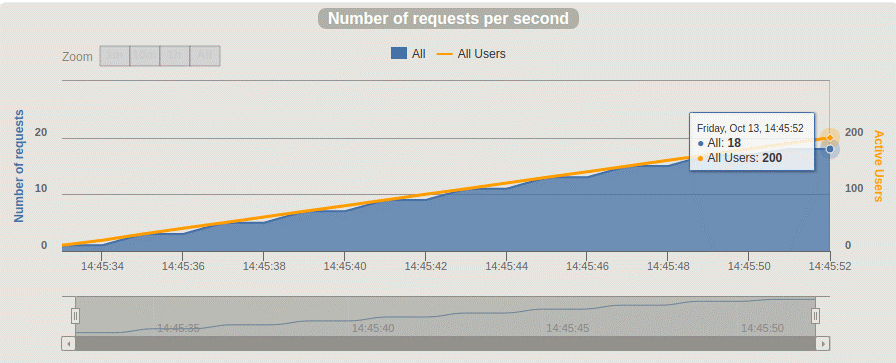

[Home](https://debbiswal.github.io/Tech-BITE/) \| [Back](https://debbiswal.github.io/Tech-BITE/#gatling)  

## How to Implement Load Test Scenarios in Gatling  

Gatling allows us to define a wide variety of performance tests. Regarding load tests, we can implement them in any of the following ways: virtual user based (VUs) or throughput based (RPS - requests per second).  

The requirements of your load tests will determine which one is better.   

Some applications need to be able to handle certain TPS, for example, a financial transaction processor, where clearly a throughput based test suits better.  

On the other hand, applications that are directly related to the number of users using it concurrently, are more suitable for virtual user based tests.  

**Virtual User Based Tests**  
To run virtual user based tests, you only need to determine how many VUs will run and how you want them to start. Below, how to run a test with 10 VUs is shown:  
  

The following code shows, for example, how to run a test with 10 concurrent VUs that will start in a 10 second ramp-up period:  
  

A ramp-up period means that once it concludes, all the defined VUs should be running. When the test starts, each VU will execute the script one time.  
  

Ideally, you should also determine how many times each VU should run (repeat), or for how long (duration).  
  

**Throughput Based Tests**  
Next, we will show you how to simulate a throughput based test. This involves defining how many RPS should be reached where a ramp-up period could also be set:  
  

This way we simulate that every second, the load will be increased with 10 more VUs. If each VU has a loop defined, after 20 seconds, there will be 200 VUs running concurrently.  

The second line of the below code limits the test load to what is defined in "throttle."  
In the previous example, the RPS was set to 20. This means that, when this value is reached, Gatling will handle VU requests so the RPS does not exceed the throttle value. Next, you see the execution graph, where the RPS stays at 20 once reached.  
  

Finally, the holdFor parameter allows you to set how long the test will run. For this example, it was set to 3 minutes.  
  

Gatling's DSL is very flexible, allowing us to implement many different scenarios.  

The above examples briefly explain how to implement either throughput or virtual user based load tests.  
Your application requirements will determine which one to implement.   

Happy Learning :)  

[Home](https://debbiswal.github.io/Tech-BITE/) \| [Back](https://debbiswal.github.io/Tech-BITE/#gatling)  
