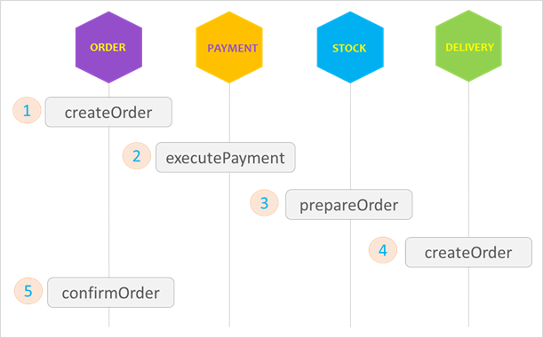
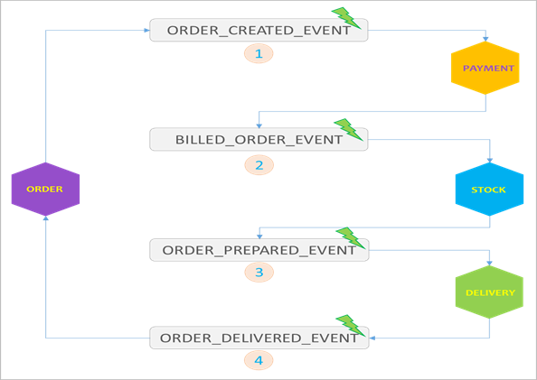

[Home](https://debbiswal.github.io/Articles) | [Back](https://debbiswal.github.io/Articles/#micro-service)

# SAGA and Distributed Transaction in Microservice - I  

Hi All,  
Today I will be discussing SAGA Pattern , which deals with Distributed Transactions in Microservice.  

So Lets Start :  

Transactions are core  part of every application  , which is used to maintain data consistency.  
Normally , we use Two-Phase Commit(2PC)  transaction type to implement this.  

In 2PC ,  the commit of the first transaction depends on the completion of a second.  
It is useful especially when you have to update multiples entities at the same time, like confirming an order and updating the stock at once.  

However, when you are working with Microservices, things get more complicated. Consider the below diagram:  
  

Each service is a system apart with its own database, and you no longer can leverage the simplicity of local two-phase-commits to maintain the consistency of your whole system.  

In the above diagram , one can’t just place an order, charge the customer, update the stock and send it to delivery all in a single ACID transaction. To execute this entire flow consistently, you would be required to create a distributed transaction.  

We all know how difficult is to implement anything distributed, and transactions, unfortunately, are not an exception. Dealing with transient states, eventual consistency between services, isolations, and rollbacks are scenarios that should be considered during the design phase.  

## The SAGA Pattern

A saga is a sequence of local transactions where each transaction updates data within a single service. The first transaction is initiated by an external request corresponding to the system operation, and then each subsequent step is triggered by the completion of the previous one.  

Using our previous example, in a very high-level design a saga implementation would look like the following:  
  

There are a couple of different ways to implement a saga transaction, but the two most popular are:  

* Events/Choreography: When there is no central coordination, each service produces and listen to other service’s events and decides if an action should be taken or not.
* Command/Orchestration: When a coordinator service is responsible for centralizing the saga’s decision making and sequencing business logic.

Let’s go a little bit deeper in each implementation to understand how they work.  

**Events/Choreography**  
In this approach, the first service executes a transaction and then publishes an event. This event is listened by one or more services which execute local transactions and publish (or not) new events.  

The distributed transaction ends when the last service executes its local transaction and does not publish any events or the event published is not heard by any of the saga’s participants.  

Let’s see how it would look like in our example:  
  

*Steps :*
* Order Service saves a new order, set the state as pending and publish an event called ORDER_CREATED_EVENT.  
* The Payment Service listens to ORDER_CREATED_EVENT, charge the client and publish the event BILLED_ORDER_EVENT.  
* The Stock Service listens to BILLED_ORDER_EVENT, update the stock, prepare the products bought in the order and publish ORDER_PREPARED_EVENT.  
* Delivery Service listens to ORDER_PREPARED_EVENT and then pick up and deliver the product. At the end, it publishes an ORDER_DELIVERED_EVENT  
* Finally, Order Service listens to ORDER_DELIVERED_EVENT and set the state of the order as concluded.  

In the case above, if the state of the order needs to be tracked, Order Service could simply listen to all events and update its state. 

In-order to publish and listen to messages/events , Services has to interact with some sort of Messaging & Workflow software’s like NServiceBus,Kafka etc .  

**Rollbacks in distributed transactions**  
Rolling back a distributed transaction does not come for free. Normally you have to implement another operation/transaction to compensate for what has been done before.  

Suppose that Stock Service has failed during a transaction. Let’s see what the rollback would look like:  
  

*Steps :*
* Stock Service produces OUT_OF_STOCK_EVENT  
* Both Order Service and Payment Service listen to the previous message  
* Payment Service refund the client  
* Order Service set the order state as failed  

*Note that it is crucial to define a common shared ID(transaction ID) for each transaction, so whenever you throw an event, all listeners can know right away which transaction it refers to.*  

**Benefits and drawbacks of using Saga’s Event/Choreography design**  
Events/Choreography is a natural way to implement Saga’s pattern, it is simple, easy to understand, does not require much effort to build, and all participants are loosely coupled as they don’t have direct knowledge of each other. If your transaction involves few steps, it might be a very good fit.  

However, this approach can rapidly become confusing if you keep adding extra steps in your transaction as it is difficult to track which services listen to which events. Moreover, it also might add a cyclic dependency between services as they have to subscribe to one another’s events.  

Finally, testing would be tricky to implement using this design, in order to simulate the transaction behavior you should have all services running.  

In next part of this article , I will explain how to address most of the problems with the Saga’s Events/Choreography approach using another Saga implementation called Command/Orchestration.  

Happy Learning :)  

[Home](https://debbiswal.github.io/Articles) | [Back](https://debbiswal.github.io/Articles/#micro-service)
