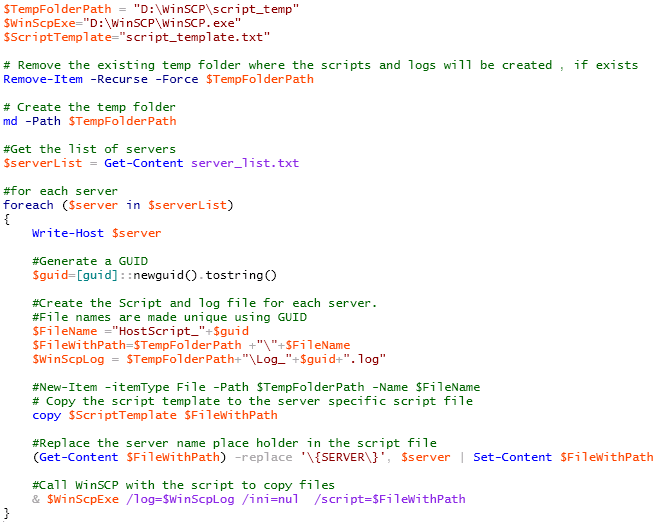

[:house:Home](https://github.com/debbiswal/Articles) | [Back](https://github.com/debbiswal/Articles/blob/master/README.md#powershell)

## Copying  files to Multiple servers using WinSCP with PowerShell script

In one of my [previous article](https://github.com/debbiswal/Articles/blob/master/WinSCP/Art-1/copy_file_multiple_server.md) I discussed about copying files using WinSCP.  

Below I am trying to explain with example , how we can copy files to multiple servers using WinSCP with Powershell script.  
It became very handy for me , during deployment time.  


* Create file with list of all servers , to which you want to copy  

*server_list.txt*   
```
LinuxServer1.tesco.org
LinuxServer2.tesco.org
LinuxServer3.tesco.org
```  

* Create a template script file(passed to winscp as parameter) with files to be copied.  
Here I am trying to copy to /tmp folder of Linux server  
The below script tries to connect to server and copies files/folders in BINARY mode(to avoid file getting corrupted)  
‘option confirm off’ is used to overwrite the files on target server , if exists.  

*script_template.txt*    
```
open sftp://MY_UID:"MY_PASSWORD"@{SERVER}/ -hostkey=*
option transfer binary
option confirm off
lcd D:
cd /tmp
put D:\Debasis\MyTestFolder
put D:\Debasis\MyTestFile.txt
put D:\Debasis\MyTestZip.tar
close
exit
```  

* Powershell scripts is used to do below  
  * Read the server list from server_list file  
  * Delete the script_temp folder , if exists  
  * For each server  
    * Copy the script_template to script_temp folder with a name like ‘HostScript_{GUID}’  
    * Replace the ‘{SERVER}’ place holder in the ‘HostScript_{GUID}’ with the server name  
    * Create the logfile name for winscp . i.e : Log_{GUID}.log  
    * Execute the winscp.exe with script and log file details  

*Note : I am creating script file for each server , in order to avoid permission issue. This issue will occur Winscp is using it and I am trying to change the {SERVER} place holder with another server name.
Separate log file is created for each server to avoid confusion while debugging.* 

*copy.ps1 :*    
  


Happy Learning :smiley:  

[:house:Home](https://github.com/debbiswal/Articles) | [Back](https://github.com/debbiswal/Articles/blob/master/README.md#powershell)
